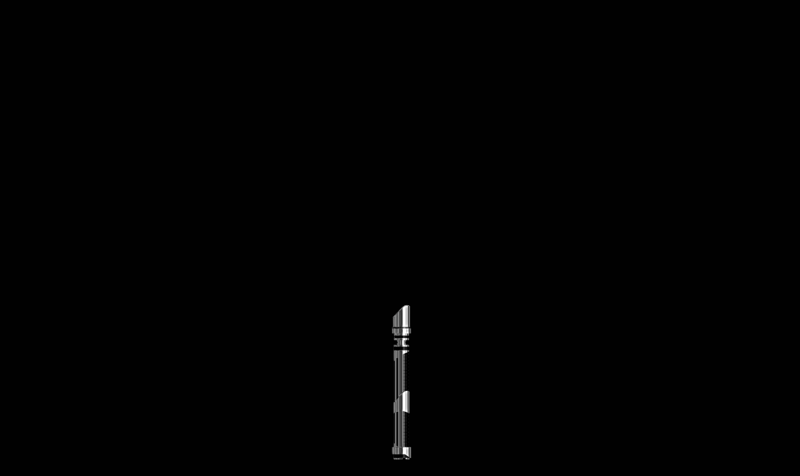

# Star Wars Lightsaber

## About

This project allows you to turn a virtual lightsaber on and off using simple controls.

## Run

Install [Live Server extension](https://marketplace.visualstudio.com/items?itemName=ritwickdey.LiveServer), right click on `index.html` file and then click on `Open with Live Server`.

## Status

Finished
